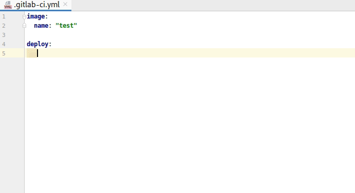

# GitLab Variables Jetbrains Autocomplete

> Jetbrains Plugin that provides autocomplete for [Predefined CI variables](https://docs.gitlab.com/ee/ci/variables/predefined_variables.html).

## Demo

## Install

Use your Jetbrains IDE Plugin manager to install.

## 🤝 Contributing

Contributions, issues and feature requests are welcome!

Please see [CONTRIBUTING.md](CONTRIBUTING.md) for details.

## Show your support

If this project have been useful for you, I would be grateful to have your support.

Give a ⭐️ to the project, or just:

## Author

👤 **Bruno Paz**

* Website: [brunopaz.dev](https://brunopaz.dev)
* Github: [@brpaz](https://github.com/brpaz)
* Twitter: [@brunopaz88](https://twitter.com/brunopaz88)

## 📝 License

Copyright © 2020 [Bruno Paz](https://github.com/brpaz).

This project is [MIT](https://opensource.org/licenses/MIT) licensed.